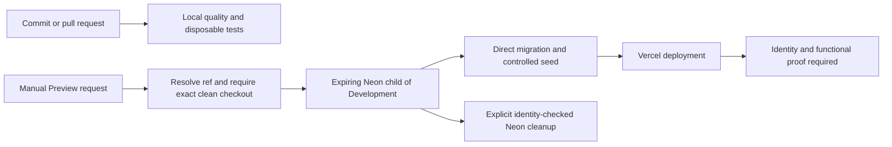

# Environments and delivery

This is an operational map of [TD-026](../../.dwf/decisions/TECHNICAL.md#td-026).
The [profile runbook](../runbooks/environment-profiles.md) owns configuration
examples and [TESTING](../../.dwf/decisions/TESTING.md) records evidence.

| Profile     | App and database                                                         | Mail and CMS                                             | Current evidence                                                                 |
| ----------- | ------------------------------------------------------------------------ | -------------------------------------------------------- | -------------------------------------------------------------------------------- |
| Local       | Local Next.js, loopback Docker PostgreSQL 18                             | Explicit local mailbox; hosted Sanity                    | Local app and disposable integration/browser suites pass                         |
| Development | Local Next.js, durable non-default Neon `development`                    | Local mailbox; read-only published Sanity                | Provision, identity inspection, guarded migration and seed recorded              |
| Preview     | Intended ephemeral Vercel deployment, expiring Neon child of Development | Controlled verified account, no sends; Sanity `preview`  | One hosted run completed 2026-09-14; explicit cleanup of that Preview id pending |
| Production  | Approved exact-ref deployment, separately protected Neon project/branch  | Resend with verified owner domain; Production CMS policy | T-23 workflow/target and real mail readiness remain unavailable                  |

Neon runtime traffic uses the pooled URL. Migrations use the direct URL.
The local direct URL can serve both roles. An existing branch called `main`
does not establish Production ownership. The running app reads `DATABASE_URL`;
profile inspection does not rewrite or retarget it.

This diagram describes the implemented orchestration, not successful hosted
proof. The Vercel adapter preflights the project for an existing Production
deployment and validates the returned deployment identity through team-scoped
lookups. One owner-authorized hosted run has completed with independent
verification; see the [run evidence](../agentforge/evidence/2026-09-14-preview-run.md)
and [Preview delivery](../runbooks/preview-delivery.md).
CI has no deployment side effect. [Production readiness](../runbooks/production-readiness.md)
describes what must exist before a release procedure can be documented as runnable.
