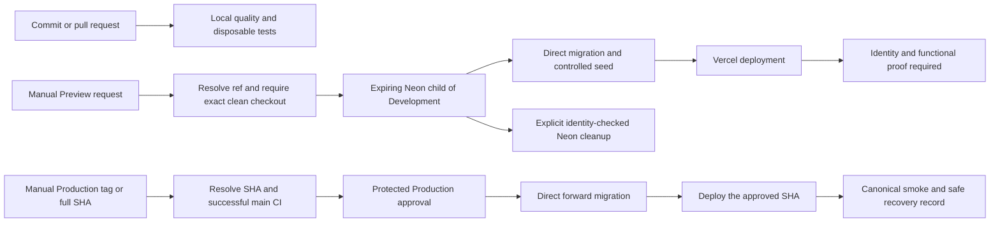

# Environments and delivery

This is an operational map of [TD-026](../../.dwf/decisions/TECHNICAL.md#td-026).
The [profile runbook](../runbooks/environment-profiles.md) owns configuration
examples and [TESTING](../../.dwf/decisions/TESTING.md) records evidence.

| Profile     | App and database                                                         | Mail and CMS                                             | Current evidence                                                                       |
| ----------- | ------------------------------------------------------------------------ | -------------------------------------------------------- | -------------------------------------------------------------------------------------- |
| Local       | Local Next.js, loopback Docker PostgreSQL 18                             | Explicit local mailbox; hosted Sanity                    | Local app and disposable integration/browser suites pass                               |
| Development | Local Next.js, durable non-default Neon `development`                    | Local mailbox; read-only published Sanity                | Provision, identity inspection, guarded migration and seed recorded                    |
| Preview     | Intended ephemeral Vercel deployment, expiring Neon child of Development | Controlled verified account, no sends; Sanity `preview`  | One hosted run completed and cleaned up 2026-09-14; each run needs owner authorization |
| Production  | Approved exact-ref deployment, separately protected Neon project/branch  | Resend with verified owner domain; Production CMS policy | Protected release, live authentication and signed Sanity webhook verified 2026-09-16   |

Neon runtime traffic uses the pooled URL. Migrations use the direct URL.
The local direct URL can serve both roles. An existing branch called `main`
does not establish Production ownership. The running app reads `DATABASE_URL`;
profile inspection does not rewrite or retarget it.

The Preview adapter preflights an existing Production deployment and validates
the returned deployment through team-scoped lookups. The Production adapter
correlates Neon/Vercel identities, records the prior deployment, and verifies
the canonical alias after release. The approved [Preview lifecycle](../agentforge/evidence/2026-09-14-preview-run.md)
and [Production release](../agentforge/evidence/2026-09-16-production-release-live.md)
have actual hosted evidence, reconciled in the [pipeline matrix](../agentforge/evidence/2026-09-16-pipeline-closeout.md).

CI has no deployment side effect. [Preview delivery](../runbooks/preview-delivery.md)
and [Production release/recovery](../runbooks/production-release.md) own the
manual procedures and authorization boundaries. Production is never seeded or
reset by delivery, and an application rollback does not undo migrations.
